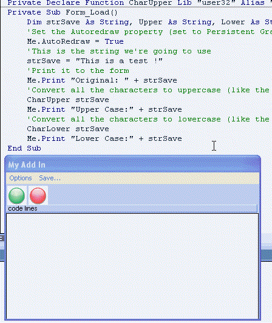



## Codeline Tracker :\>  copies each line of U'r code as it executes so U can examine code flow

### Description

This is a simple addin that can help you examine the exact flow of your code. It copies each line of code as it executes...then you can save this as a text file and examine to detect potential weaknesses or bottlenecks your program may have
 
### More Info
 

             |
---                |---
**Submitted On**   |2005-03-10 01:08:44
**By**             |[Evan Toder](https://github.com/Planet-Source-Code/PSCIndex/blob/master/ByAuthor/evan-toder.md)
**Level**          |Intermediate
**User Rating**    |5.0 (25 globes from 5 users)
**Compatibility**  |VB 5\.0, VB 6\.0
**Category**       |[Custom Controls/ Forms/  Menus](https://github.com/Planet-Source-Code/PSCIndex/blob/master/ByCategory/custom-controls-forms-menus__1-4.md)
**World**          |[Visual Basic](https://github.com/Planet-Source-Code/PSCIndex/blob/master/ByWorld/visual-basic.md)
**Archive File**   |[Codeline\_T1863183102005\.zip](https://github.com/Planet-Source-Code/evan-toder-codeline-tracker-copies-each-line-of-u-r-code-as-it-executes-so-u-can-examine-c__1-59406/archive/master.zip)

